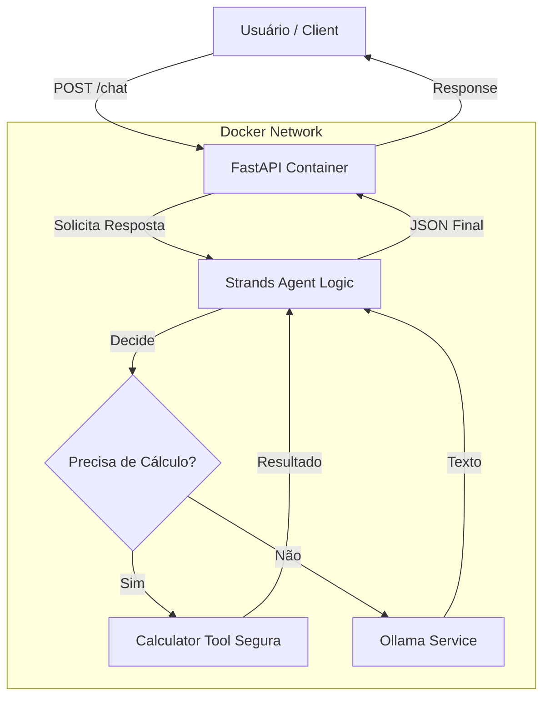

# Teste Técnico - API de Chat com Agente de IA

Projeto desenvolvido como parte do processo seletivo para a vaga de Estágio em IA na DreamSquad.
O objetivo é integrar uma API FastAPI com um Agente de IA (Strands SDK) capaz de utilizar ferramentas matemáticas.

## Diferenciais da Solução

Além dos requisitos funcionais, este projeto foi estruturado com foco em **Engenharia de Software e DevOps**:

* **Arquitetura Modular:** Separação clara entre API (FastAPI), Lógica de Negócio (Agent) e Configurações.
* **DevOps & IaC:** Containerização avançada (Init Containers) e esboço de infraestrutura AWS com Terraform.
* **Automação:** Script `run.sh` para setup "One-Click" com verificação de ambiente e health checks.
* **Qualidade de Código:** Pipeline de CI (GitHub Actions), Linter rigoroso (Ruff) e Pre-commit hooks.
* **Segurança:** Execução de código matemático em ambiente isolado (sandbox) com validação de Regex.
* **Observabilidade:** Middleware customizado para logs de performance e rastreamento de requisições.
* **Otimização de Performance:** Optei por utilizar o modelo Llama 3.2 (3B) em vez do Llama 3.1 (8B). Como o ambiente de execução local geralmente depende de CPU, o modelo 3.2 oferece uma resposta significativamente mais rápida (menor latência) mantendo a capacidade de raciocínio e uso de ferramentas, ideal para a UX deste desafio.

## Arquitetura da Solução



## Tecnologias

* **Python 3.11**
* **FastAPI** (API REST)
* **Strands Agents SDK** (Orquestração de Agentes)
* **Ollama** (LLM Local - Llama3.2)
* **Docker & Docker Compose**
* **Pytest** (Testes Automatizados)
* **Terraform** (Infra as Code)
* **Ruff & Pre-commit** (Code Quality)
* **GitHub Actions** (CI)

## Como Executar (Zero Config)

Este projeto utiliza Docker Compose para orquestrar a API e o servidor de inferência (Ollama) automaticamente. **Não é necessário instalar o Ollama manualmente na sua máquina**.

### **Pré-requisito**

* Apenas **Docker** e **Docker Compose** instalados.

#### **Opção 1: Script de Automação (Recomendado)**

Execute o script que prepara o ambiente, aguarda o carregamento da IA e exibe os logs:

```bash
./run.sh
```

#### **Opção 2: Manual (Docker Compose)**

Execute o script que prepara o ambiente, aguarda o carregamento da IA e exibe os logs:

```bash
docker-compose up --build
```

**O que acontece automaticamente:**

1. O servidor Ollama sobe isolado.
2. Um container temporário baixa e **pré-aquece** o modelo `llama3.2` na memória.
3. A API inicia somente após o modelo estar pronto para uso imediato.

## Testando a API

Utilize o Swagger UI em `http://localhost:8000/docs` ou faça requisições via curl:

1. Pergunta Matemática (Usa a Tool)

```bash
curl -X POST "http://localhost:8000/chat" \
     -H "Content-Type: application/json" \
     -d '{"message": "Quanto é 1234 * 5678?"}'
```

2. Pergunta Geral (Usa o LLM)

```bash
curl -X POST "http://localhost:8000/chat" \
     -H "Content-Type: application/json" \
     -d '{"message": "Explique o que é DevOps em uma frase."}'
```

## Qualidade e Segurança

O projeto segue padrões estritos de desenvolvimento:

* **Testes Automatizados**: Validação de lógica e segurança (prevenção de injeção).

```bash
./run.sh test
# ou: docker-compose run --rm api pytest tests/ -v
```

* **Linting**: Código formatado segundo PEP8 usando **Ruff**.
* **Pre-commit**: Hooks configurados para impedir commits fora do padrão.

## Infraestrutura (Simulação)

A pasta `infra/` contém um manifesto **Terraform** demonstrando como esta aplicação seria provisionada em um ambiente de produção AWS (ECS Fargate + ECR), evidenciando conhecimentos de Cloud Computing.

## Estrutura do Projeto

```txt
.
├── .github/        # Pipeline de CI (GitHub Actions)
├── app/
│   ├── agent.py    # Configuração do Agente e Tools
│   ├── api.py      # Endpoints e Modelos Pydantic
│   ├── config.py   # Gestão de Variáveis de Ambiente
│   ├── main.py     # Entrypoint da Aplicação com Swagger customizado
│   └── utils.py    # Middleware de Observabilidade
├── infra/          # Código Terraform (IaC AWS)
├── tests/          # Testes Unitários e de Segurança
├── .env.example    # Modelo de variáveis de ambiente
├── .gitignore
├── .pre-commit-config.yaml
├── docker-compose.yml
├── Dockerfile
├── pyproject.toml  # Configuração do Ruff (Linter)
├── README.md
├── requirements.txt
└── run.sh          # Script de automação (CLI)
```

---
Desenvolvido por **Ícaro Torres**.
